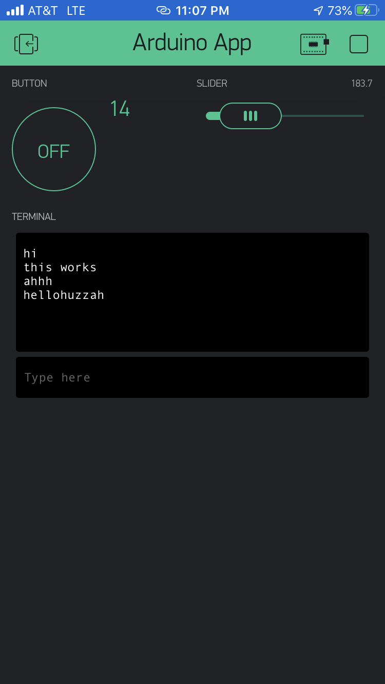

Name: Alvin Zhang

EID: ayz249

Team Number: F1

## Questions

1. What is the purpose of an IP address?

    An IP Address hosts or networks interface identification and location addressing. It relays datagrams across network boundaries and enables internetworking.

2. What is a DNS? What are the benefits of using domain names instead of IP addresses?

    The Domain Name System is a decentralized, hierarchical naming system for devices connected to the internet. It can associate various information along with the domain names that are assigned to each particiapting entity, which can later be translated into IP addresses.

3. What is the difference between a static IP and a dynamic IP?

    Static IP does not change after it has been assigned, while a dynamic IP address is assigned by the network when they connect, and can change over time.

4. What is the tradeoff between UDP and TCP protocols?

    TCP ports provide reliable communication and UDP ports provide unreliable best-effort communication. This means that TCP is connection based and reliable with no loss, while UDP is connectionless, relatively unreliable, but fast.

5. Why can't we use the delay function with Blynk?

    Since Blynk is event based, delay will mess up the timing and break the system. We want Blynk to operate asynchronously, meaning that events can happen at any time in a timely manner, and is not affected by the process of other functions.

6. What does it mean for a function to be "Blocking"?

    A function is "Blocking" when it is actively affecting the running of other processes. This can happen when a function is barring another function from being able to run until it is completed with its own work.

7. Why are interrupts useful for writing Non-Blocking code?

    Interrupts are useful for writing non-blocking code because it is able to stop current processes in order to run another set of instructions of higher priority. This means that high priority processes can execute in a timely manner without unforseen delays.

8. What is the difference between interface and implementation? Why is it important?

   An interface defines how a function is called while an implementation describes what the function actually does. This is important because in cases such as Blynk, how and when a function is called can be predetermined while the user is free to alter its functionality.

9. Screenshot of your Blynk App:

    
